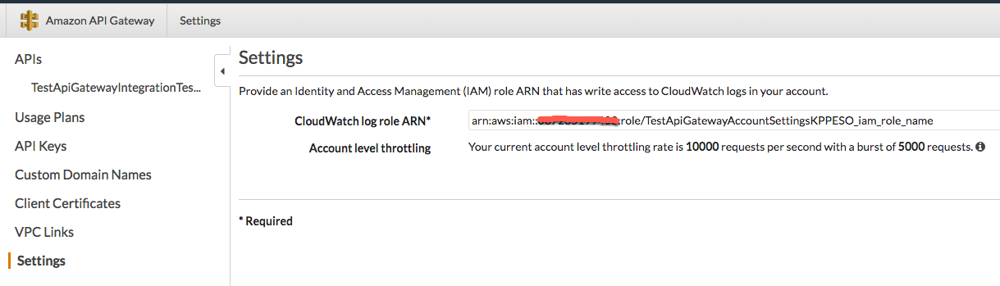

# API Gateway Account Settings Module

This module allows you set the regional settings required to allow API Gateway to write to CloudWatch logs.

## Overview

Each Region in AWS must be configured with an IAM Role that gives API Gateway permissions to create and write to CloudWatch
logs. Without this configuration, API Gateway will not be able to write logs. This configuration is done regionally
(only once per region) irrespective of the number of API Gateways deployed in that region.

This module creates an IAM role, assigns it the appropriate permissions and sets it as the "CloudWatch log role ARN" in
the API Gateway configuration.

The corresponding screen from the AWS Console is shown below:



## Quick start

Check out the [examples](https://github.com/biptec/terraform-aws-lambda/blob/v0.15.0/examples) for sample code that demonstrates how to use this module.

## How do you use this module?

To use this module, you need to do the following:

1. [Add the module to your Terraform code](#add-the-module-to-your-terraform-code)

### Add the module to your Terraform code

As with all Terraform modules, you include this one in your code using the `module` keyword and pointing the `source`
URL at this repo:

```hcl
module "api_gateway_account" {
  source = "git::git@github.com:gruntwork-io/package-sam.git//modules/api-gateway-account-?ref=v0.0.1"

  iam_role_name = "api_gateway_cloudwatch_global"
}
```
